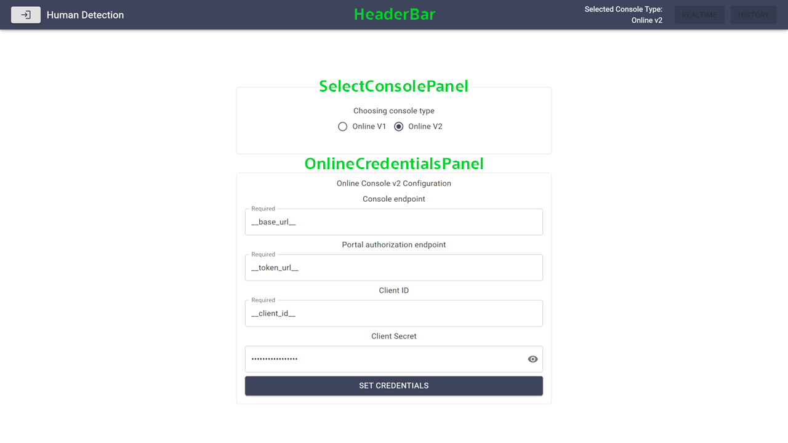
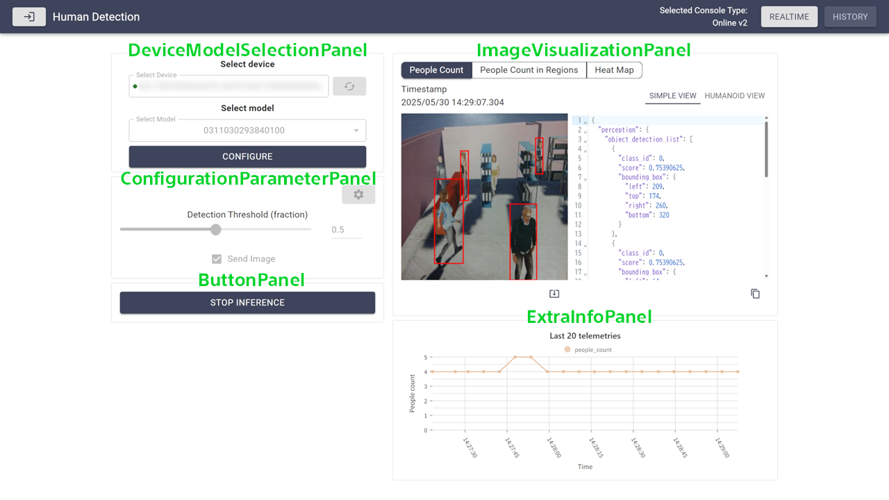
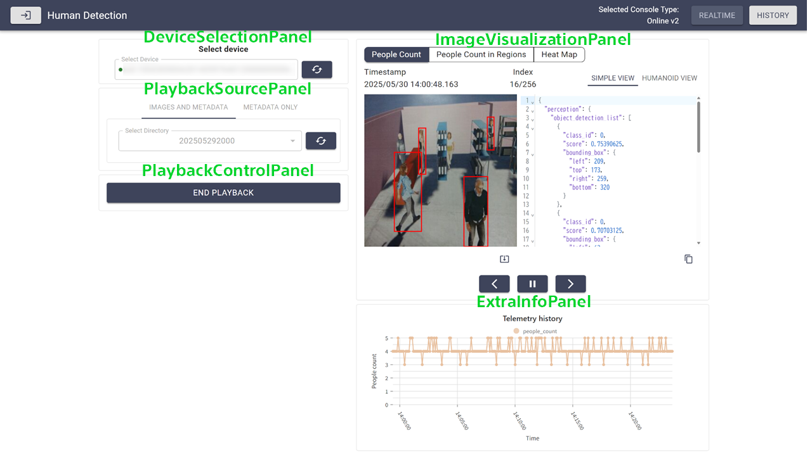
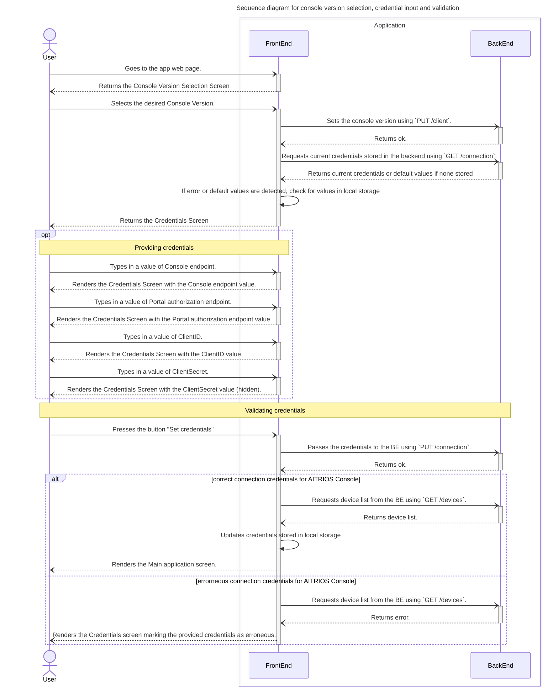
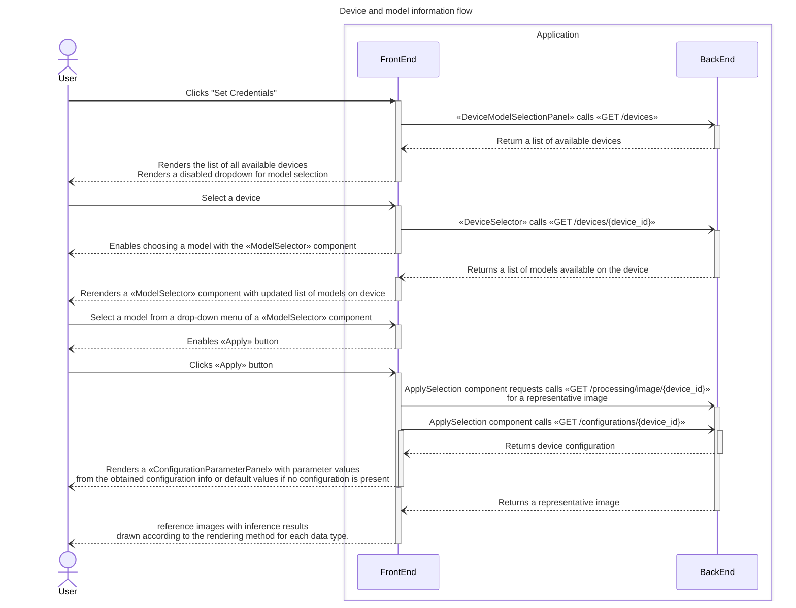
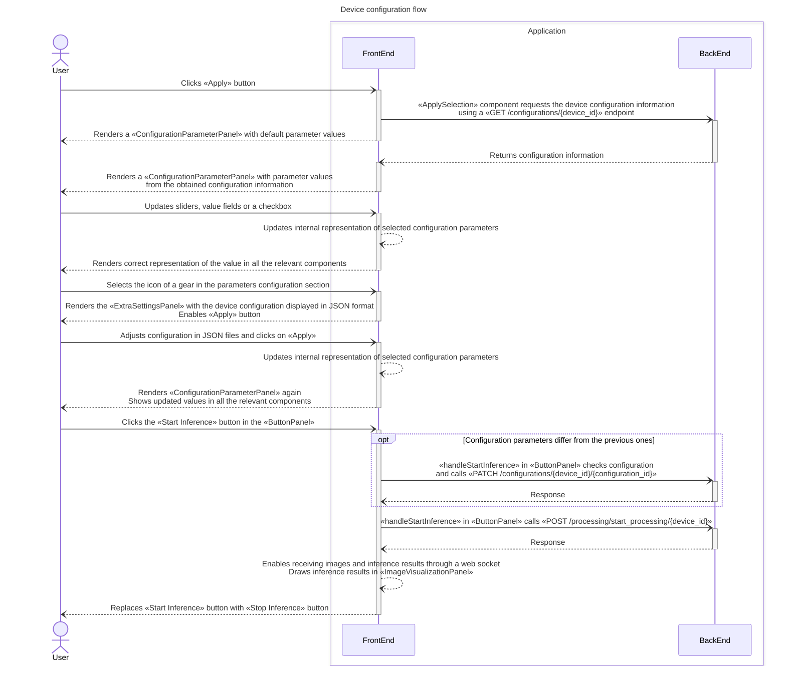
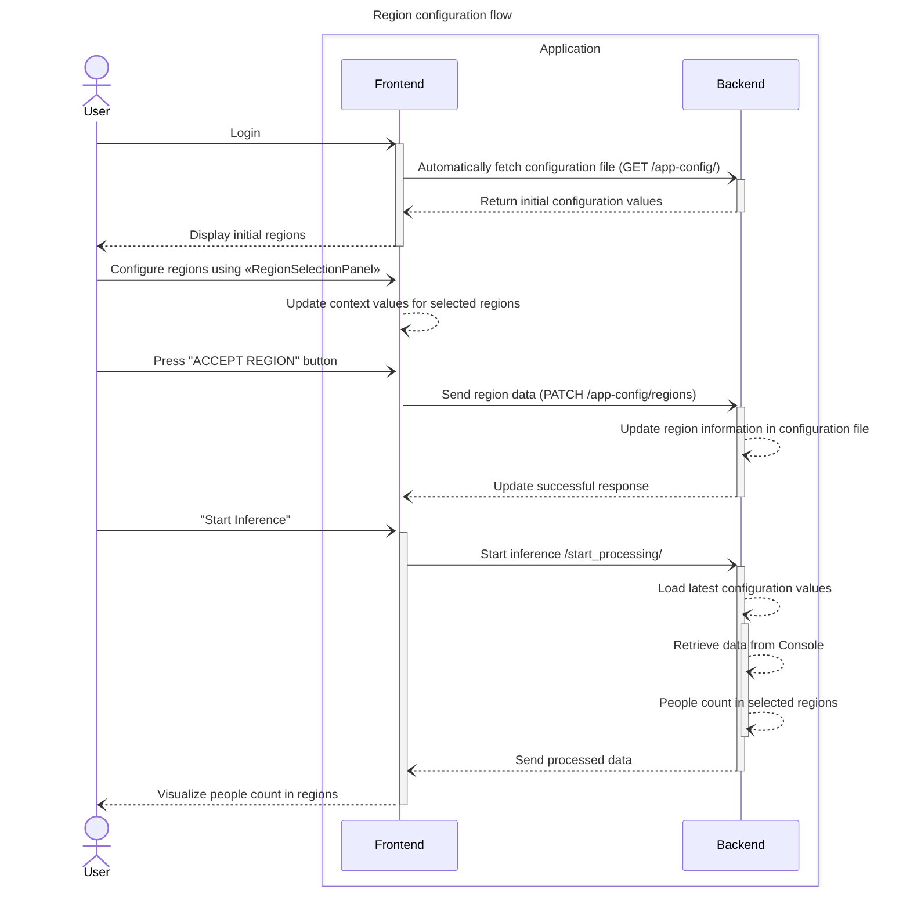
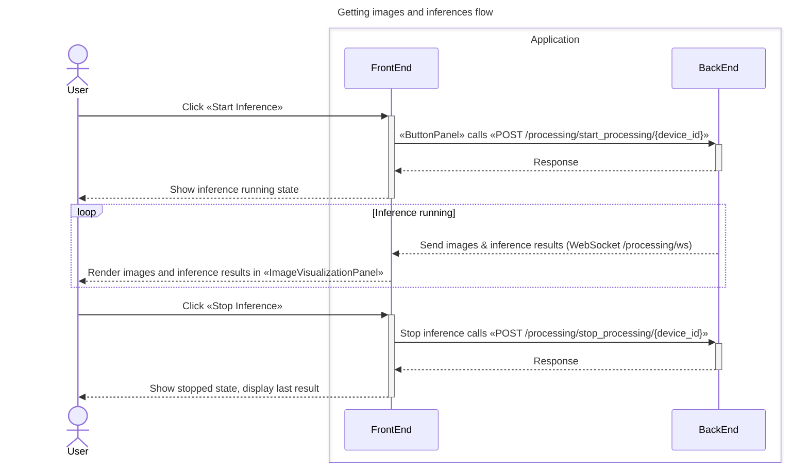
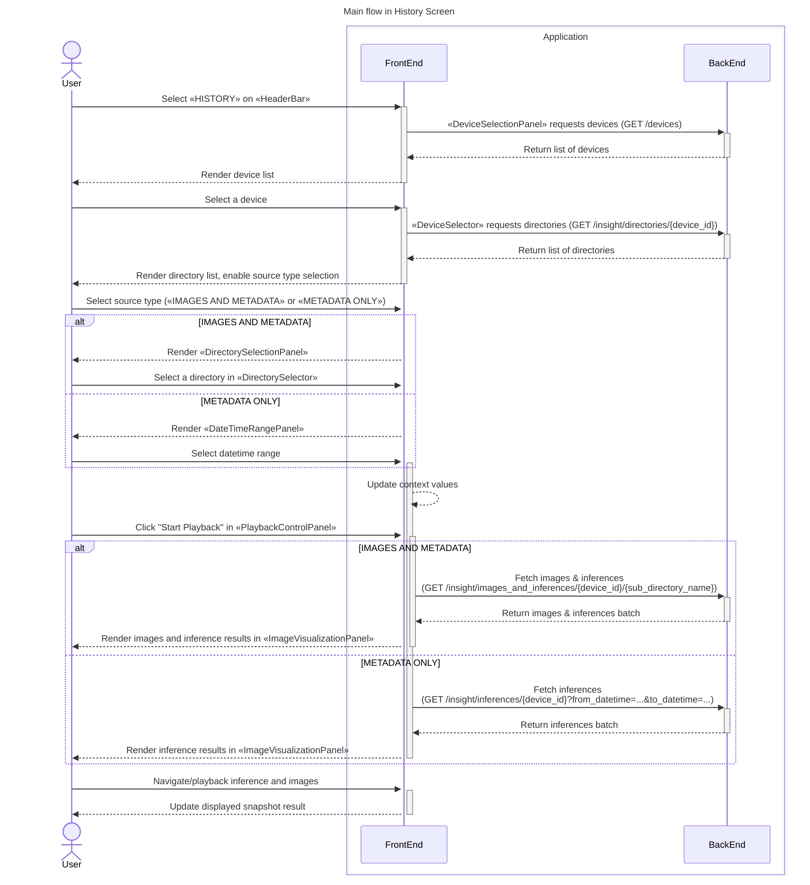

# Interaction logic between user interface and backend

This document explains the workflow of using the web application in the form of sequence diagrams. We start by listing and describing the main UI panels. Then we explain the basic workflow in Login Screen, Realtime Screen and History Screen.

## UI Panels
The UI consists of the following panels that can be found in their corresponding files of the various [components] folders.
- [`src/components`](../frontend/app/src/components/)
- [`src/features/login-screen/components`](../frontend/app/src/features/login-screen/components)
- [`src/features/human-detection/components`](../frontend/app/src/features/human-detection/components)
- [`src/features/human-detection/realtime-mode/components`](../frontend/app/src/features/human-detection/realtime-mode/components)
- [`src/features/human-detection/history-mode/components`](../frontend/app/src/features/human-detection/history-mode/components)

The following sections describe the main panels and how they interact with the backend.

### Common

<b>HeaderBar</b>

[`HeaderBar`](../frontend/app/src/components/HeaderBar.tsx) displays the name of the app, the selected console type, and contains buttons to switch between Realtime Screen and History Screen. It also provides a button to return to Console selection.

### Login Screen

<b>SelectConsolePanel</b>

[`SelectConsolePanel`](../frontend/app/src/features/login-screen/components/SelectConsolePanel.tsx) allows the user to select which Console to use, from among the listed ones.

Endpoints used by `SelectConsolePanel` and its children:
- [*Router* `/connection`](../backend/app/routers/connection.py)
  - `GET /connection`
  - `PUT /connection`
- [*Router* `/client`](../backend/app/routers/client.py)
  - `GET /client`

FE-BE interaction for this panel is implemented in:
- [*ConsoleConfiguration.tsx*](../frontend/app/src/features/login-screen/utils/ConsoleConfiguration.tsx)

<b>OnlineCredentialsPanel</b>

[`OnlineCredentialsPanel`](../frontend/app/src/features/login-screen/components/OnlineCredentialsPanel.tsx) allows the user to specify the configuration options required to access any type of Online Console. These options include which endpoints to use, as well as the Client credentials.

Endpoints used by `OnlineCredentialsPanel` and its children:
- [*Router* `/connection`](../backend/app/routers/connection.py)
  - `GET /connection`
  - `PUT /connection`
- [*Router* `/devices`](../backend/app/routers/device.py)
  - `GET /devices`

FE-BE interaction for this panel is implemented in:
- [*DeviceInfoFromConsole.tsx*](../frontend/app/src/utils/DeviceInfoFromConsole.tsx)

### Realtime Screen

<b>DeviceModelSelectionPanel</b>

[`DeviceModelSelectionPanel`](../frontend/app/src/features/human-detection/realtime-mode/components/DeviceModelSelectionPanel.tsx) allows the user to select Device and Model from those available in the selected Console. Initially, only the Device selection is enabled, and once the user has selected a Device, the Model selection is enabled as well, listing all the models in the device.

Endpoints used by `DeviceModelSelectionPanel` and its children:
- [*Router* `/devices`](../backend/app/routers/device.py)
  - `GET /devices/{device_id}`

FE-BE interaction for this panel is implemented in:
- [*DeviceInfoFromConsole.tsx*](../frontend/app/src/utils/DeviceInfoFromConsole.tsx)

<b>ConfigurationParameterPanel</b>

[`ConfigurationParameterPanel`](../frontend/app/src/features/human-detection/realtime-mode/components/ConfigurationParameterPanel.tsx) contains child components for displaying and adjusting the configuration parameters of the app.

Child components of `ConfigurationParameterPanel`:
  - [`DefaultSettingsPanel`](../frontend/app/src/features/human-detection/realtime-mode/components/DefaultSettingsPanel.tsx)
  - [`ExtraSettingsPanel`](../frontend/app/src/features/human-detection/realtime-mode/components/ExtraSettingsPanel.tsx)

**DefaultSettingsPanel**

This panel allows the user to visualize and edit the device configuration values using sliders and checkboxes. The list of editable values is hardcoded in the Sample Application, and it's independent of the Console selection.

This panel does not communicate with the Backend. The updates in the configuration are stored locally, and communicated to the Backend with starting inference using the [*ButtonPanel*](#buttonpanel).

**ExtraSettingsPanel**

This panel allows the user to visualize and edit the device configuration values in a JSON manner. The exact format of the configuration will depend on various factors, such as the type of Console used or the device selected.

This panel does not communicate with the Backend. The updates in the configuration are stored locally, and communicated to the Backend with starting inference using the [*ButtonPanel*](#buttonpanel).

<b>ButtonPanel</b>

[`ButtonPanel`](../frontend/app/src/features/human-detection/realtime-mode/components/ButtonPanel.tsx) serves to collect together buttons of *Start inference* and *Stop inference*.

Endpoints used by `ButtonPanel` and its children:
- [*Router* `/configuration`](../backend/app/routers/configuration.py):
  - `PATCH /configurations/{file_name}`
- [*Router* `/processing`](../backend/app/routers/processing.py):
  - `POST /processing/start_processing/{device_id}`
  - `POST /processing/stop_processing/{device_id}`

FE-BE interaction for this panel is implemented in:
- [*EdgeAppConfigurationFromConsole.tsx*](../frontend/app/src/utils/EdgeAppConfigurationFromConsole.tsx)
- [*ProcessingService.tsx*](../frontend/app/src/utils/ProcessingService.tsx)

<b>ImageVisualizationPanel</b>

[`ImageVisualizationPanel`](../frontend/app/src/features/human-detection/realtime-mode/components/ImageVisualizationPanel.tsx) visualizes the latest captured images and displays inference results according to the selected solution type.

Child components of `ImageVisualizationPanel`:
- [`SolutionTab`](../frontend/app/src/features/human-detection/components/SolutionTab.tsx)
- [`BBoxHumanoidTab`](../frontend/app/src/features/human-detection/components/BBoxHumanoidTab.tsx)
- [`Canvas`](../frontend/app/src/features/human-detection/components/Canvas.tsx)
- [`InferenceDataDisplay`](../frontend/app/src/features/human-detection/components/InferenceDataDisplay.tsx)

Endpoints used by `ImageVisualizationPanel` and its children:
- [*Router* `/processing`](../backend/app/routers/processing.py)
  - Connection to a `/processing/ws`

FE-BE interaction for this panel is implemented in:
- [*ImageStream.tsx*](../frontend/app/src/utils/ImageStream.tsx)

<b>ExtraInfoPanel</b>

[`ExtraInfoPanel`](../frontend/app/src/features/human-detection/realtime-mode/components/ExtraInfoPanel.tsx) visualizes inference data as timeseries graphs for realtime screen.

Child components of `ExtraInfoPanel`:
- [`PeopleCountPlot`](../frontend/app/src/features/human-detection/realtime-mode/components/PeopleCountPlot.tsx)
- [`PeopleCountInRegionsPlot`](../frontend/app/src/features/human-detection/realtime-mode/components/PeopleCountInRegionsPlot.tsx)

### History Screen

<b>DeviceSelectionPanel</b>

[`DeviceSelectionPanel`](../frontend/app/src/features/human-detection/history-mode/components/DeviceSelectionPanel.tsx) allows the user to select a Device. Once the user has selected a device, subsequent panels become available.

Endpoints used by `DeviceSelectionPanel` and its children:
- [*Router* `/devices`](../backend/app/routers/device.py)
  - `GET /devices/{device_id}`

FE-BE interaction for this panel is implemented in:
- [*DeviceInfoFromConsole.tsx*](../frontend/app/src/utils/DeviceInfoFromConsole.tsx)

<b>PlaybackSourcePanel</b>

[`PlaybackSourcePanel`](../frontend/app/src/features/human-detection/history-mode/components/PlaybackSourcePanel.tsx) allows users to select between image-based or time-based methods for retrieving historical inference data.

Child components of `PlaybackSourcePanel`:
  - [`DirectorySelectionPanel`](../frontend/app/src/features/human-detection/history-mode/components/DirectorySelectionPanel.tsx)
  - [`DateTimeRangePanel`](../frontend/app/src/features/human-detection/history-mode/components/DateTimeRangePanel.tsx)

**DirectorySelectionPanel**

This panel allows the user to select an image directory based on the selected device. These selections of image data sources are stored locally and communicated to the Backend when fetching images and inferences associated with images using the PlaybackControlPanel.

Endpoints used by `DeviceSelectionPanel` and its children:
- [*Router* `/insight`](../backend/app/routers/insight.py)
  - `GET /insight/directories/{device_id}`

FE-BE interaction for this panel is implemented in:
- [*ImagesAndInferencesFromConsole.tsx*](../frontend/app/src/utils/ImagesAndInferencesFromConsole.tsx)

**DateTimeRangePanel**

This panel allows the user to select datetime range for configuring the metadata retrieval scope based on the selected device. These selections are stored locally and communicated to the Backend when fetching metadata using the PlaybackControlPanel.

<b>PlaybackControlPanel</b>

[`PlaybackControlPanel`](../frontend/app/src/features/human-detection/history-mode/components/PlaybackControlPanel.tsx) serves to collect together buttons of Start playback and Stop playback.

Endpoints used by `PlaybackControlPanel` and its children:
- [*Router* `/insight`](../backend/app/routers/insight.py)
  - `GET /insight/images_and_inferences/{device_id}/{sub_directory_name}`
  - `GET /insight/inferences/{device_id}`

FE-BE interaction for this panel is implemented in:
- [*ImagesAndInferencesFromConsole.tsx*](../frontend/app/src/utils/ImagesAndInferencesFromConsole.tsx)

<b>ImageVisualizationPanel</b>

[`ImageVisualizationPanel`](../frontend/app/src/features/human-detection/history-mode/components/ImageVisualizationPanel.tsx) visualizes captured images and displays inference results according to the selected solution type. Unlike the Realtime Screen, this panel shows images one by one from a batch retrieved by the PlaybackControlPanel.

Child components of `ImageVisualizationPanel`:
- [`SolutionTab`](../frontend/app/src/features/human-detection/components/SolutionTab.tsx)
- [`BBoxHumanoidTab`](../frontend/app/src/features/human-detection/components/BBoxHumanoidTab.tsx)
- [`Canvas`](../frontend/app/src/features/human-detection/components/Canvas.tsx)
- [`InferenceDataDisplay`](../frontend/app/src/features/human-detection/components/InferenceDataDisplay.tsx)

<b>ExtraInfoPanel</b>

[`ExtraInfoPanel`](../frontend/app/src/features/human-detection/history-mode/components/ExtraInfoPanel.tsx) visualizes inference data as timeseries graphs for history screen.

Child components of `ExtraInfoPanel`:
- [`PeopleCountPlot`](../frontend/app/src/features/human-detection/history-mode/components/PeopleCountPlot.tsx)
- [`PeopleCountInRegionsPlot`](../frontend/app/src/features/human-detection/history-mode/components/PeopleCountInRegionsPlot.tsx)

## FE-BE Interactions

### User Workflow Overview

1. **Open the Application**
   Launch the app and see the HeaderBar and SelectConsolePanel.

2. **Select Console & Enter Credentials**
   Choose a Console, enter credentials in OnlineCredentialsPanel, and apply.

3. **Realtime Mode**
   - Select device/model in DeviceModelSelectionPanel.
   - Adjust parameters in ConfigurationParameterPanel.
   - Start inference with ButtonPanel.
   - View realtime results in ImageVisualizationPanel and ExtraInfoPanel.

4. **History Mode**
   - Select device in DeviceSelectionPanel.
   - Choose data source in PlaybackSourcePanel.
   - Start playback with PlaybackControlPanel.
   - View historical results in ImageVisualizationPanel and ExtraInfoPanel.

### Login screen

<b>Console selection and credential setup flow</b>

This is the screen to configure the settings to connect to the selected Console project.

### Realtime Screen

<b>Device and model information flow</b>

This sections describes the flow of information to select the console, device, model and edge application to use. These interactions are contained in the [`DeviceModelSelectionPanel`](../frontend/app/src/features/human-detection/realtime-mode/components/DeviceModelSelectionPanel.tsx) and its components. Once the user selects a console and sets the credentials, this panel allows them to select a device and a model previously deployed on this device. Once the selection is accepted, the application fetches an image and the device configuration, and displays them in the `ImageVisualizationPanel` and `ConfigurationParameterPanel` respectively.

Child components of `DeviceModelSelectionPanel`:
- [*ApplySelection.tsx*](../frontend/app/src/features/human-detection/realtime-mode/components/ApplySelection.tsx)
- [*DeviceSelector.tsx*](../frontend/app/src/features/human-detection/realtime-mode/components/DeviceSelector.tsx)
- [*ModelSelector.tsx*](../frontend/app/src/features/human-detection/realtime-mode/components/ModelSelector.tsx)

Endpoints used by `DeviceModelSelectionPanel` and its children:
- [*Router* `/device`](../backend/app/routers/device.py)
  - `GET /devices/`
  - `GET /devices/{device_id}`
- [*Router* `/configuration`](../backend/app/routers/configuration.py)
  - `GET /configurations/{device_id}`
- [*Router* `/processing`](../backend/app/routers/processing.py)
  - `GET /processing/image/{device_id}`

FE-BE interaction is implemented in:
- [*DeviceInfoFromConsole.tsx*](../frontend/app/src/utils/DeviceInfoFromConsole.tsx)
- [*EdgeAppConfigurationFromConsole.tsx*](../frontend/app/src/utils/EdgeAppConfigurationFromConsole.tsx)
- [*GetImageFromConsole.tsx*](../frontend/app/src/utils/GetImageFromConsole.tsx)

<b>Device configuration flow</b>

This sections describes the flow to interact with the Device/Application configurations. These interactions are contained in the [`ConfigurationParameterPanel`](../frontend/app/src/features/human-detection/realtime-mode/components/ConfigurationParameterPanel.tsx). This panel displays the configuration parameters of an Edge Application that a user can change from UI, which includes sliders and checkboxes for some of the parameters. All the changes performed on this panel are stored in the Frontend and are only passed to the Backend upon pressing the button "Start Inference" in the `ButtonPanel`.

This panel is first rendered with the default values and is blocked for change while the application is receiving and parsing the device configuration information. Upon its completion, the components are rendered again with the values obtained, and only then the frontend enables modifying its values.

Child components of `ConfigurationParameterPanel`:
- [*CustomCheckBox.tsx*](../frontend/app/src/components/CustomCheckBox.tsx)
- [*CustomSlider.tsx*](../frontend/app/src/components/CustomSlider.tsx)

<b>Region configuration flow</b>

This section describes the flow for interacting with Region settings when using the "People Count in Regions" feature. These interactions are contained in the [`RegionSelectionPanel`](../frontend/app/src/features/human-detection/components/RegionSelectionPanel.tsx). The sequence diagram below illustrates the process:

- initial loading of settings files
- configuration of regions through the GUI
- saving changes to settings files
- processing inference data based on configuration files in the backend

Endpoints used by `RegionSelectionPanel` and their children:
- [*Router* `/app-config`](../backend/app/routers/app_config.py)
  - `GET /app-config/`
  - `PATCH /app-config/`

<b>Getting images and inferences flow</b>

### History Screen

<b>Main flow</b>

This section describes the flow of information for fetching historical inference data by selecting image folders (IMAGES AND METADATA) or by selecting datetime ranges (METADATA ONLY). These interactions are contained in the [`PlaybackSourcePanel`](../frontend/app/src/features/human-detection/history-mode/components/PlaybackSourcePanel.tsx) and its components. Once the selection is accepted, the application fetches an images and inference results, and displays them in the [`ImageVisualizationPanel`](../frontend/app/src/features/human-detection/history-mode/components/ImageVisualizationPanel.tsx).

Child components of `PlaybackSourcePanel`:
- [`DirectorySelectionPanel`](../frontend/app/src/features/human-detection/history-mode/components/DirectorySelectionPanel.tsx)
  - [`DirectorySelector`](../frontend/app/src/features/human-detection/history-mode/components/DirectorySelector.tsx)
- [`DateTimeRangePanel`](../frontend/app/src/features/human-detection/history-mode/components/DateTimeRangePanel.tsx)

Endpoints used by `DeviceSelectionPanel`, `PlaybackSourcePanel`, `PlaybackControlPanel` and their children:
- [*Router* `/device`](../backend/app/routers/device.py)
  - `GET /devices/`
- [*Router* `/insight`](../backend/app/routers/insight.py)
  - `GET /insight/directories/{device_id}`

- [*Router* `/insight`](../backend/app/routers/insight.py)
  - `GET /insight/images_and_inferences/{device_id}/{sub_directory_name}`
  - `GET /insight/inferences/{device_id}`

FE-BE interaction is implemented in:
- [*DeviceInfoFromConsole.tsx*](../frontend/app/src/utils/DeviceInfoFromConsole.tsx)
- [*ImagesAndInferencesFromConsole.tsx*](../frontend/app/src/utils/ImagesAndInferencesFromConsole.tsx)

