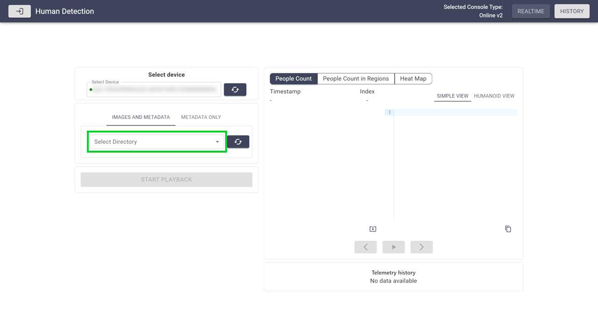

## 1. Open the Application
Follow the [USAGE.md](USAGE.md) guide to start the application.

## 2. Select AITRIOS Online Console Version
Upon launching, the landing page will prompt the user to select the AITRIOS Online Console version to use.


## 3. Enter Console Credentials
Once a console version is selected, the user must enter their credentials. Click the **Set Credentials** button to proceed to the main view.


## 4. Select Mode
After successful authentication, users can choose between two modes:

- **Realtime Mode**: Start inference on devices connected to the Console and fetch realtime images and inference results.
- **History Mode**: Fetch historical images and inference results uploaded to the Console.


## 5. Solution Types

This application supports three solution types for human detection analysis: **People Count**, **People Count in Regions**, and **Heat Map**. These are available in both Realtime Mode and History Mode.

The following sections provide an overview of each solution type. For detailed implementation, see [human_detection.py](../backend/app/human_detection.py).

> [!Important]
> Configuration values for all solution types (`people_count_settings`, `people_count_in_regions_settings`, `heatmap_settings`) are stored in [app_config.yaml](../backend/app/config/app_config.yaml). The configuration is loaded once at startup, so restart the application after making changes. Detailed parameters for each solution type are shown below.

### 5.1. People Count
Counts the total number of detected people within the entire screen area.

**Configuration:**
```yaml
people_count_settings:
  bbox_to_point_ratio: 0.9
```
> The `bbox_to_point_ratio` parameter calculates head coordinates from bounding boxes for backend solutions (People Count in Regions, Heat Map) and frontend display (Humanoid View). For People Count, it's only used for frontend display since no backend head coordinate calculation is required.

### 5.2. People Count in Regions
Counts people within specific defined regions on the screen.

**Algorithm:**
1. Calculate head coordinates from each bounding box based on `bbox_to_point_ratio`.
2. Count the number of head coordinates contained within each region's defined area based on `regions`.

**Configuration:**
```yaml
people_count_in_regions_settings:
  bbox_to_point_ratio: 0.9
  regions:
  - id: "region1"
    left: 0
    top: 0
    right: 150
    bottom: 320
  - id: "region2"
    left: 170
    top: 0
    right: 320
    bottom: 320
```

### 5.3. Heat Map
Generates a heat map based on accumulated detection data across multiple frames.

**Algorithm:**
1. Calculate head coordinates from each bounding box based on `bbox_to_point_ratio` and map them to grid cells defined by `grid_num_w` and `grid_num_h`.
2. Accumulate detection data using a first-in-first-out approach:
   - Store detection data for up to `last_valid_frame` number of frames
   - When the frame limit is reached, first remove the oldest frame data and then add new data
3. Generate heatmap based on the accumulated detection data

**Configuration:**
```yaml
heatmap_settings:
  bbox_to_point_ratio: 0.9
  last_valid_frame: 600
  image_size_w: 320
  image_size_h: 320
  grid_num_w: 8
  grid_num_h: 8
```

## 6. Realtime Mode
### 6.1. Select Device and Model
Click the **Select Device** dropdown and choose a device from the list of enrolled devices in your project.


Click the **Select Model** dropdown and choose a model from the list of models available on the selected device.


Click **Apply** to continue.


### 6.2. Select Solution Type
Once your device and model are configured, choose a solution type from the solution tab. For detailed explanations, see [Solution Types](#5-solution-types).


### 6.3. Adjust Configurations
In Realtime Mode, users have multiple configuration options:

1. **Reconfigure** device and model selection via the **Configure** button.
2. **Select regions** to count detections for people using the **Select Region** button (People Count in Regions only).
3. **Adjust parameters** with sliders and value input boxes.
4. **Enable or disable image reception** using the **Send Image** checkbox.
5. **Access extra settings** using the ⚙️ button.
6. **Start inference on device** using **Start Inference**.
7. **Switch display type** between **Simple View** and **Humanoid View** regardless of inference status.
   - **Simple View**: Show detected people as bounding boxes.
   - **Humanoid View**: Show human-shaped markers based on detection results.


> In Humanoid View, head position uses bounding box center (X) and `bbox_to_point_ratio` for vertical positioning within the bounding box (Y), while body proportions are automatically scaled based on head size by `headToBodyRatio` in `Canvas.tsx`.

**People Count**


**People Count in Regions**


**Heat Map**


### 6.4. Start Inference
To begin inference, click the **Start Inference** button.

The canvas displays the latest results as they are received, updating frame by frame.
The graph shows the most recent 20 data points, allowing you to monitor trends and counts in real time.

#### 6.4.1. People Count Result Example


#### 6.4.2. People Count in Regions Result Example


#### 6.4.3. Heat Map Result Example


> [!Note]
> The examples above demonstrate different combinations of display modes (Simple/Humanoid View) and image settings (Send Image on/off). All display modes and image settings are available for all solution types.

## 7. History Mode

### 7.1. Select Device
Click **Select Device** and choose a device from the dropdown list of enrolled devices in your project.


### 7.2. Select Solution Type
Once your device is selected, choose a solution type from the solution tab.

The available solution types and their algorithms are the same as in Realtime Mode. For detailed explanations, see [Solution Types](#5-solution-types).


### 7.3. Select Data Source

Choose the type of data you want to fetch from the Console:

- **Images and Metadata**: Fetch images and inference data based on the image directory.
- **Metadata Only**: Fetch only inference data based on datetime.


#### 7.3.1. Select Image Directory (Images and Metadata)
Click **Select Directory** and choose the image directory you want to view on the selected device. The image directory names are represented by timestamps.




#### 7.3.2. Select DateTime (Metadata Only)
Select the desired time range for the data you want to fetch.


> [!Important]
> History mode has the following data fetch limitations based on API specifications:
> - **Images and Metadata**: Maximum 256 images starting from the oldest in the selected image directory
> - **Metadata Only**: Maximum 256 inference results, starting from the newest in the selected time range
>
> In Images and Metadata mode, metadata is retrieved based on the time range of the captured images. When metadata-only results exist within this range, some images may fail to obtain their corresponding metadata properly.

### 7.4. Start Playback
To begin playback, click the **Start Playback** button.

The canvas displays the latest results as they are received, updating frame by frame. The graph shows the entire range of fetched data at once, enabling you to identify trends and counts across the selected time range.

#### 7.4.1. Images and Metadata Result Example


#### 7.4.2. Metadata Only Result Example


> [!Note]
> Examples show People Count, but all solution types and display modes are available in History Mode.